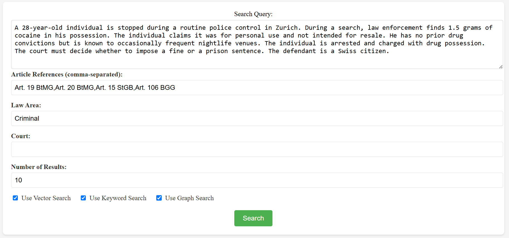
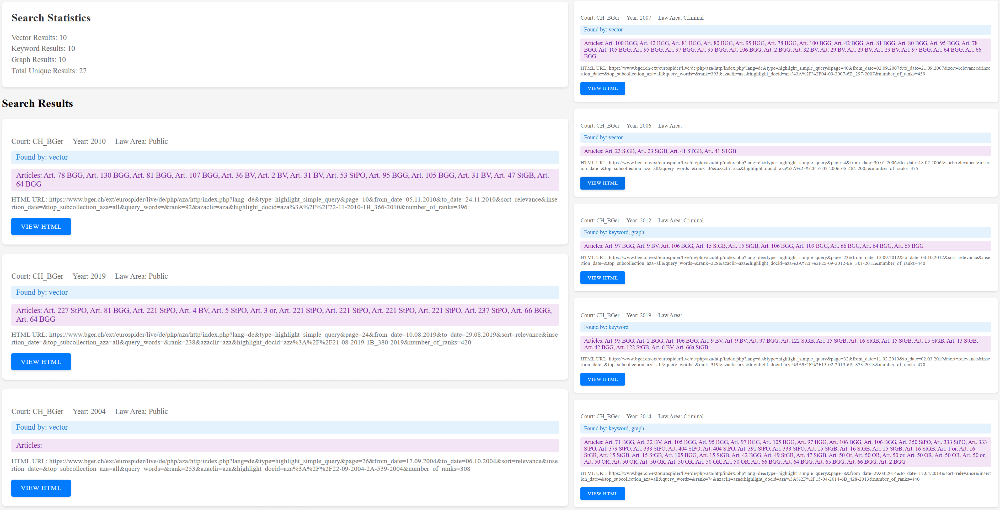

# Swiss Court Rulings Search

A smart search engine for Swiss court rulings that combines three different search methods to find the most relevant legal precedents for your case.

## How It Works

The search engine uses three complementary methods to find relevant rulings:

### 1. Vector Search
- Uses text embeddings to understand the semantic meaning of your case description
- Compares your case with all rulings using cosine similarity
- Great for finding rulings that discuss similar legal concepts, even if they use different words

### 2. Keyword Search
- Uses an inverted index built on 2000+ rulings
- Searches for both single words and pairs of words (bigrams)
- Ranks results based on:
  - Number of keyword matches
  - Article mentions (rulings that cite the same legal articles get higher priority)
- Returns top 10 most relevant matches

### 3. Graph Search
- Creates a network of rulings where each ruling is a node
- Connects rulings with edges based on three criteria:
  - Common legal articles (rulings that cite the same laws) (around 55% of total edge weight contribution)
  - Same court and law area (rulings from the same court in the same legal field) (around 15% of total edge weight contribution)
  - Text similarity (rulings with similar content) (around 30% of total edge weight contribution)
- Finds rulings that are legally related to your case through these connections


---
## UI and Results
<div align="center">
  
  <p><em>Above, one sees the UI, where the user can enter the details of his case, if available/applicable.</em></p>
</div>
<div align="center">
  
  <p><em>Above, one sees the returned results.</em></p>
</div>
 ---
 
---
## Ruling Graph Visualization 
<div align="center">
  
  <p><em>Above is depicted the graph of rulings (showing the greatest component). A vertex represents a unique ruling and an edge between two vertices implies some minimal connectivity criteria is met.</em></p>
</div>
 ---

## Project Structure

```
.
├── frontend/           # React frontend
├── src/               # Python backend
├── data/              # Data files
└── requirements.txt   # Python dependencies
```

## Local Development

### Backend Setup
1. Create a virtual environment:
   ```bash
   python -m venv venv
   source venv/bin/activate  # On Windows: venv\Scripts\activate
   ```
2. Install dependencies:
   ```bash
   pip install -r requirements.txt
   ```
3. Run the backend server:
   ```bash
   python src/search_rulings_api.py
   ```

### Frontend Setup
1. Navigate to the frontend directory:
   ```bash
   cd frontend
   ```
2. Install dependencies:
   ```bash
   npm install
   ```
3. Run the development server:
   ```bash
   npm start
   ```

## Deployment

The application consists of two parts:
- Backend: Python Flask API
- Frontend: React web application

Each part needs to be deployed to a suitable hosting service that supports its technology stack.

## Environment Variables

### Backend
- `PORT`: Port number (default: 5000)

### Frontend
- `REACT_APP_API_URL`: Backend API URL

## API Endpoints

- `POST /api/search`: Search for court rulings
  - Parameters:
    - `query`: Search text
    - `articles`: List of article references
    - `law_area`: Law area filter
    - `court`: Court filter
    - `num_results`: Number of results to return 
